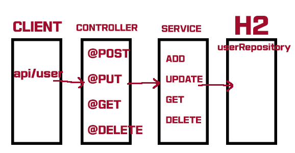

# GraphQL & Restful API

# Repository 소개

- 2021년 원메딕스인더스트리 백-엔드 채용 테스트 코드 (GraphQL 통신)

## 🎯 Target

- Restful API로 구현을 해봤지만, 처음 접해본 GraphQL 통신 방식과 차이점을 유관으로 확인해보기
- GraphQL에 대한 통신 방식 이해

## 개요

- 개발 환경: Springboot (Gradle), Jdk 1.8, Spring JPA, GraphQL

## Restful API 구조

## GraphQL 구조

