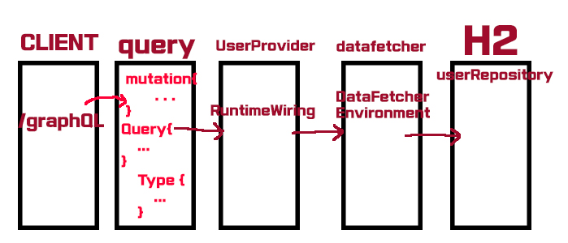

# GraphQL & Restful API

# Repository 소개

- GraphQL 

## 🎯 Target

- Restful API로 구현을 해봤지만, 처음 접해본 GraphQL 통신 방식과 차이점을 유관으로 확인해보기
- GraphQL에 대한 통신 방식 이해

## 개요

- 개발 환경: Springboot (Gradle), Jdk 1.8, Spring JPA, GraphQL

## Restful API 구조

## GraphQL 구조

## API 설계
|기능|Method|URL| Request Params / Body|
|:---|:---:|:---:|:---:|
|Restful 유저 등록|POST|api/user| email, username, password |
|Restful 유저 전체 조회|GET|/api/user||
|Restful 유저 수정|POST|/api/user/{id}| email, password |
|Restful 유저 삭제|DELETE|/api/user/{id}| username, password |
|GraphQL 유저 등록||/graphQL| mutation{addUser(email: "", username: "", password: "")} |
|GraphQL 유저 개별 조회||/graphQL| {user(username: "a"){username email password}} |
|GraphQL 전체 조회||/graphQL| {users{username email password}} |
|GraphQL 유저 수정||/graphQL| mutation{updateUser(username: "", email: "", password: "")}|
|GraphQL 유저 삭제||/graphQL| mutation{deleteUser(username: "")} |

## 개선 하고 싶은 점
- GraphQL Query에 대한 공부 (.graphql 파일 문법을 더 자세히 알고 싶다)
- .graphql 파일의 Schema, Mutation, Type 이해
- GraphQL로 부터 CLIENT 한테 전달 받는 데이터 타입 및 반환 되는 데이터 타입 이해
- datafetcher 및 schema 작성법

## 참고 자료
- https://www.youtube.com/watch?v=zX2I7-aIldE
- https://www.youtube.com/watch?v=rH2kdMPUQpQ&list=PLiwhu8iLxKwL1TU0RMM6z7TtkyW-3-5Wi&index=2

